<h1 align="center">Meli ML Chanllenge 🚀 </h1> 

## Resumen: 
El presente proyecto tiene como fin plantear una posible solución para el reto técnico planteado, el cual consiste en diseñar y construir un sistema que realice las siguientes tareas a partir de diferentes documentos en formato pdf:  

***1. Clasificación automática por tipo de documento:***  

   Cada archivo debe ser clasificado en una de las siguientes categorias: 
   - Contrato
   - Resolución
   - Certificado
   - Factura
2. **Detección de datos sensibles (PII)**
     
Identifica y resalta información confidencial como:
- Nombres completos  
- Números de identificación  
- Correos electrónicos  
- Teléfonos  
- Direcciones
  
3. **Identificación de documentos duplicados o similares**
  
Detecta documentos duplicados por medio de un checksum MD5.

4. **Segmentación y extracción de secciones de interés (Opcional)**

Extrae de cada documento la sección específica que contiene requisitos normativos,  
cuando exista, o marca el documento como “No Aplica”.

## Arquitectura y diseño de la solución

El siguiente diagrama resume cómo está construida la presente solución:

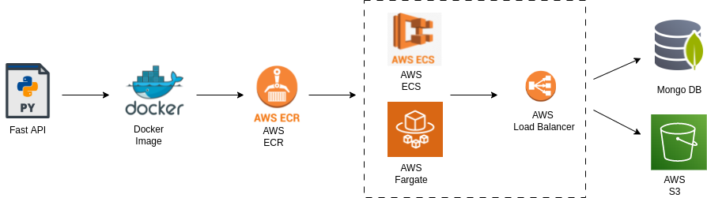

### Desarrollo y construcción de la aplicación 

La aplicación fue desarrollada en FastAPI y luego construida como una imagen de docker la cual se almacena en Amazon ECR para su posterior despliegue.

  
### Despliegue de la aplicación 

En cuanto al despliegue se utilizó AWS ECS con Fargate como servicio de orquestación para ejecutar la imagen en un entorno serverless, asimismo se utilizó un Load Balancer que permite el acceso externo a la API.

### Servicios externos conectados 

Se utiliza MongoDB como base de datos para almacenar el texto extraído de los documentos, así como otros procesamientos realizados (clasificación de documentos, extracción de PII, información de duplicados, extracción de secciones de interés).

Por otro lado, también se cuenta con un bucket de S3 para almacenar los documentos utilizados tanto en el entrenamiento del modelo, que se describe más adelante, como en las diferentes pruebas de la aplicación.

## Implementación detallada de la solución

Para el desarrollo de la aplicación, se procuró seguir principios de arquitectura limpia, organizando el proyecto en módulos con responsabilidades definidas. A continuación se explicara cada uno de los modulos:

### Extracción de texto 
Para abordar el problema planteado, el primer paso realizado fue lograr la extracción de texto de archivos pdf, para esto se utilizó amazon textract debido a que ofrece una extracción robusta basada en machine learning,que no solo reconoce texto impreso, sino también estructuras complejas como tablas y formularios.

De igual manera para enfrentar el problema de el procesamiento asincronico se utilizo start_document_text_detection, esta opción permite iniciar múltiples procesos de extracción en paralelo sin necesidad de esperar a que cada uno finalice antes de continuar con el siguiente.

Para gestionar este procesamiento concurrente, se implementó una estrategia que permite lanzar varios trabajos de análisis al mismo tiempo, hacer seguimiento de cada uno de ellos de forma no bloqueante, y finalmente recolectar los resultados una vez completados. Una vez obtenidos los textos de los archivos pdf, se almacenan en la base de datos, lo que permite su posterior uso en tareas como clasificación automática, detección de información sensible o análisis de secciones normativas.

### Clasificación en categorias

#### Pre procesamiento y entrenamiento del modelo

Con el fin de implementar el sistema clasificador de textos, fueron necesarios unos pasos previos al desarrollo del modulo. En primer lugar se recolectaron diferentes archivos pdf con el objetivo de armar un dataset, de esta manera los documentos referentes a contratos, resoluciones y certificados, se obtuvieron del repositorio de datos abiertos de Secop II [Datos abiertos Secop II](https://www.datos.gov.co/Gastos-Gubernamentales/SECOP-II-Contratos-Electr-nicos/jbjy-vk9h/about_data), de igual manera para las facturas, se utilizaron plantillas de ejemplo.

En total se obtuvieron la siguiente cantidad de documentos, la cantidad de paginas variaba por documento, algunos tenian hasta 15 páginas:

Certificados: 49  
Contratos:43  
Resoluciones: 56  
Facturas: 37  

Una vez recolectados los documentos de entrenamiento, se procedió a construir el dataset en formato tabular, con el fin de utilizarlo como entrada para los modelos,Este proceso se llevó a cabo mediante un notebook de Jupyter, ubicado en la ruta notebooks/create_tabular_dataset.py, la salida fue un archivo CSV que contiene los campos: filename, label (etiqueta correspondiente a la clase del documento) y text (texto extraído del PDF utilizando Amazon Textract) y se encuentra en la ruta notebooks/data/dataset.csv

Una vez obtenido el dataset tabular, se procedió a realizar diferentes pruebas utilizando modelos de aprendizaje automático tradicional. Para ello, se implementó una etapa de vectorización del texto puesto que  Los modelos no entienden palabras directamente, por lo cual la vectorización convierte el texto en representaciones numéricas que los algoritmos de machine learning pueden procesar. Se inició con un modelo de regresión logística debido a su simplicidad y buen desempeño en problemas de clasificación de texto. Los datos se dividieron en un 80 % para entrenamiento y un 20 % para validación. A continuación, se presentan los resultados obtenidos:

  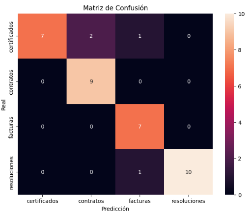

  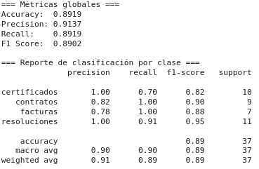

Aunque los resultados fueron prometedores, se decidió mejorar el preprocesamiento del texto incorporando una pequeña etapa de limpieza y tokenización del texto utilizando la libreria de procesamiento de lenguaje natural nltk para optimizar la calidad de las características extraídas. Además se decidió evaluar varios modelos de clasificación como adicional a la regresión logistica como Lineal SVM, Random Forest, Multinomial Naive Bayes, con el fin de comparar y elegir el que brindara mejores métricas. A continuación se muestran los resultados de cada uno de los modelos con la limpieza de texto realizada

Regresión Logistica

  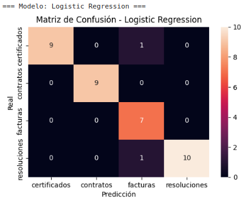

  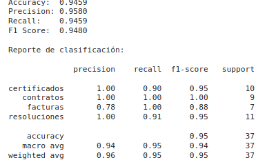

SVM

  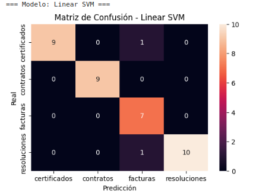

  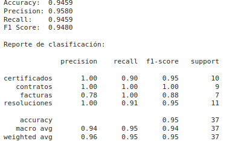

Random Forest

  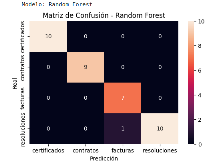

  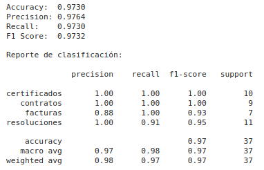

NB

  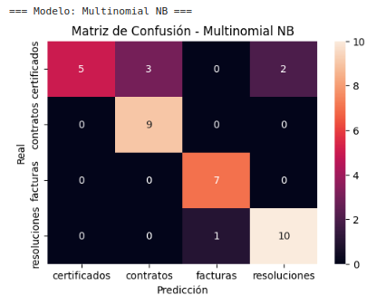

  

Como se puede observar, en términos generales y para todas las métricas (Accuracy, Precision, Recall y F1-score), el modelo Random Forest alcanzó un desempeño cercano al 97%. Por ello, fue seleccionado para su implementación en el módulo de clasificación de categorías.

#### Implementación modulo clasificador

Una vez obtenido el modelo clasificador, se desarrolló el módulo encargado de determinar la categoría que mejor se ajusta al documento. Para ello, se consulta en la base de datos el texto extraído de los PDFs y se realiza la clasificación correspondiente. Finalmente, el módulo almacena dos campos: la categoría asignada y los scores, es decir, los puntajes de probabilidad asociados a cada una de las categorías.

### Detección de datos sensibles (PII)

Para este módulo se utilizó la biblioteca spaCy para el reconocimiento de entidades nombradas (NER), específicamente para la categoría de nombres propios. De igual manera, se implementó el modelo es_core_news_lg de la misma biblioteca, el cual proporciona un análisis lingüístico del idioma español. Este modelo fue elegido por su mayor tamaño y precisión en comparación con otras versiones más livianas, en el siguiente enlace se pueden encontrar las métricas oficiales de la libreria [spacy](https://spacy.io/models/es).

De igual manera, para los otros campos Número de identificación, correos electrónicos, número de telefono y direcciones, se utilizo un método más sencillo como lo son el reconocimiento de expresiones regulares, las cuales permiten identificar patrones específicos en los textos de manera eficiente y automatizada.

Para este modulo se consulta el campo text de la base de datos, el cual se obtiene en el modulo de extracción de texto, se realiza el procesamiento para obtener las diferentes categorias explicadas anteriormente y se guardan los resultados en el campo pii_entities.

### Identificación de documentos duplicados o similares

Para este módulo se utilizó el método sugerido en la guía, checksum MD5, el cual permite identificar duplicados al generar un valor hash único para cada archivo o registro. De esta forma, al comparar los valores hash, es posible detectar fácilmente entradas idénticas y evitar el procesamiento redundante de datos. 

Sin embargo, el problema que presenta chacksum MD5 es que solo permite identificar los archivos que son exactamente iguales, no identifica archivos similares o con pequeñas diferencias, por lo cual también se implementó la libreri ssdeep la cual utiliza hashing difuso (fuzzy hashing) para detectar similitudes entre archivos, permitiendo así identificar duplicados parciales o versiones ligeramente modificadas de un mismo archivo. 

Para este módulo se requieren directamente los documentos en formato PDF, por lo cual se extraen todos los archivos almacenados en el bucket de S3 y se realizan las comparaciones correspondientes. Finalmente, se almacenan en la base de datos, en los campos extract_duplicates y similar_files, las listas de archivos duplicados y similares respectivamente.

### Segmentación y extracción de secciones de interés.(Opcional)

Para este módulo se emplearon expresiones regulares diseñadas específicamente para identificar y extraer secciones relevantes dentro de los documentos, tales como referencias a artículos, leyes, decretos, resoluciones y normativas vigentes. Estas expresiones permiten capturar patrones complejos de texto relacionados con disposiciones legales y regulatorias.

No obstante, este módulo puede mejorarse significativamente aplicando técnicas avanzadas de procesamiento de lenguaje natural (PLN), como el uso de modelos de reconocimiento de entidades nombradas (NER), análisis semántico y aprendizaje automático, para lograr una extracción más precisa y contextualizada, especialmente en casos donde las expresiones regulares tradicionales puedan presentar limitaciones ante variaciones en el lenguaje o formatos menos estructurados.

El funcionamiento es similar al módulo de detección de datos PII. Es decir, se consulta el campo text de la base de datos, el cual se obtiene en el módulo de extracción de texto. A partir de este texto, se realiza el procesamiento para identificar y extraer las secciones de interés. Finalmente, se almacenan en el campo normative_section una lista con las secciones relevantes de requisitos normativos encontradas en el texto, o se indica que no aplica en caso de no hallar ninguna sección pertinente.

## Pautas de uso

La aplicación se encuentra desplegada en el siguiente enlace [api](http://meli-ml-challenge-313187819.us-east-2.elb.amazonaws.com/docs#/) donde se puede encontrar la documentación interactiva de los endpoints disponibles.Antes de interactuar con cualquiera de ellos, es necesario realizar un proceso de autenticación mediante JWT (JSON Web Token), el cual se ha implementado con el fin de proteger los recursos de la API y garantizar que solo usuarios autorizados puedan acceder a las funcionalidades expuestas.Se puede acceder a la api con las siguientes credenciales:

Usuario:user  
Contraseña:user

#### Autenticación 
 
Para realizar la autenticación se debe ejecutar el endpoint /api/v1/token, el cual solicita como parametros el usuario y contraseña anteriormente mencionados, a continuación se muestra un ejemplo de lo que debería salir en pantalla cuando la autenticación es exitosa

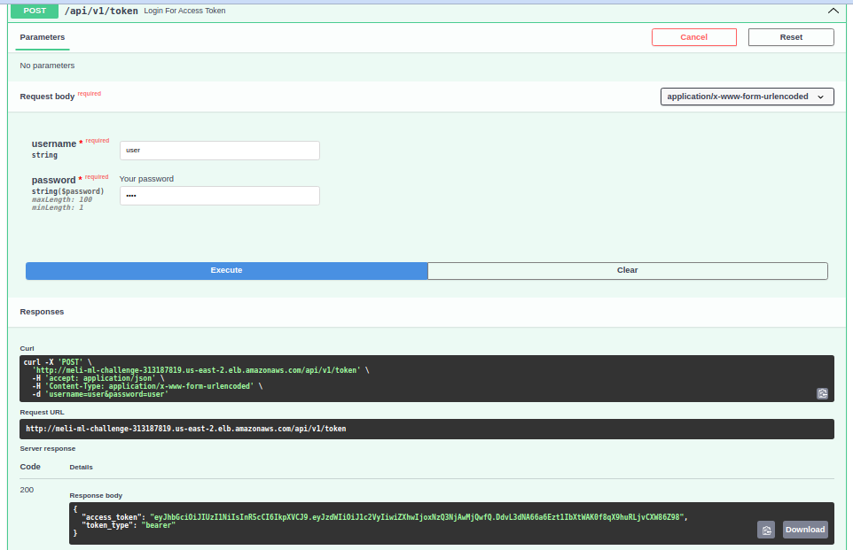

El resultado de este endpoint es un token de acceso (JWT), el cual debe ser copiado para poder realizar el proceso de autorización.

#### Autorización

En la parte superior izquierda de la interfaz se encuentra un botón con la palabra "Authorize". Al hacer clic en este botón, se despliega una ventana emergente que solicita como parámetro el token de acceso obtenido en el paso anterior. De la siguiente manera:

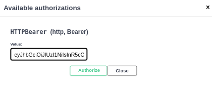

Una vez autorizado se podran ejecutar cada uno de los endpoints que se desarrollaron para la presente prueba

#### Extractor de texto

El primer endpoint a probar es el encargado de extraer el texto de diferentes archivos PDF. Este endpoint recibe como parámetro de entrada una lista de documentos en formato PDF. 

Para efectos de prueba, se enviarán tres archivos PDF: certificado1.pdf, certificado12.pdf y resolucion1.pdf. Cabe resaltar que los archivos certificado1.pdf y certificado12.pdf son prácticamente iguales, salvo por una pequeña modificación en el texto realizada intencionalmente. A continuación, se muestra un ejemplo de cómo debe estructurarse la petición:

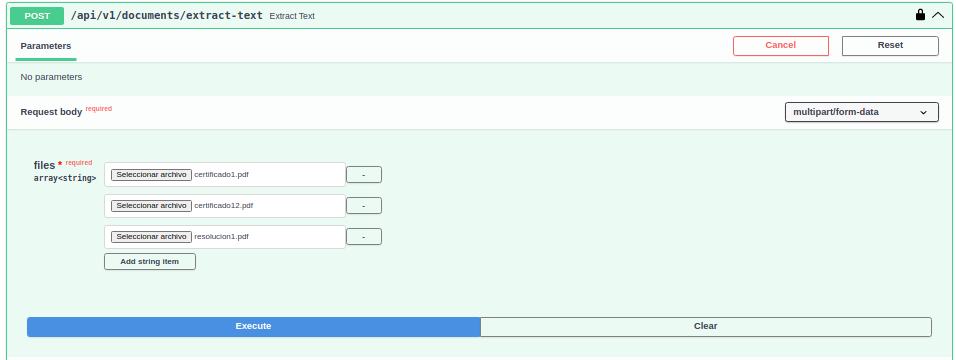

Si todo sale bien se deberia obtener lo siguiente:

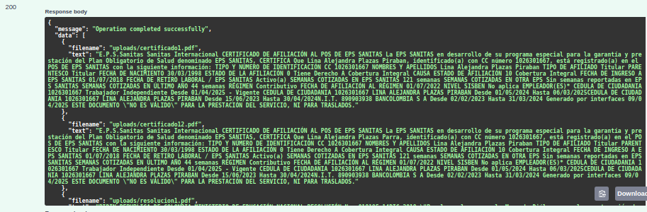

De esta manera, luego de ejecutar este endpoint, los archivos enviados en la solicitud deberían cargarse correctamente en el bucket S3. Al mismo tiempo, en la base de datos se deberían almacenar tres registros, uno por cada archivo procesado. Cada registro debería contener, el nombre del archivo y el texto extraído del mismo, tal como se muestra a continuación

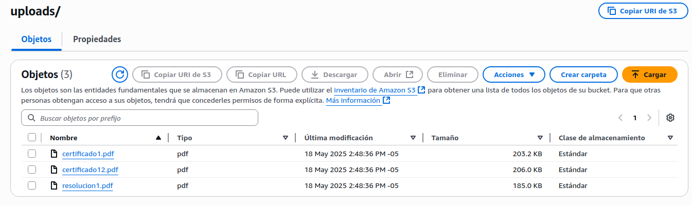

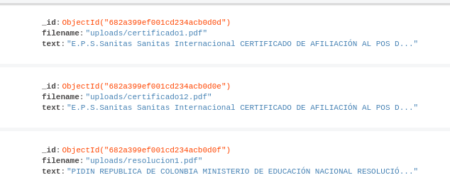

#### Clasificador de texto

Una vez se haya realizado el proceso de extracción de texto y los resultados se encuentren almacenados en la base de datos, el endpoint /classify-text se encarga de procesar dicho texto y determinar a qué categoría pertenece cada documento. Las categorías posibles son: contrato, certificado, resolución y factura.

Para probar este endpoint, se puede enviar como parámetro una lista opcional de cadenas de texto (tipo list[str]), en la que se especifican los nombres de los archivos que se desean clasificar.

Es importante resaltar que, si la lista se envía vacía ([]), el sistema procederá a clasificar todos los registros existentes en la base de datos, como se muestra a continuación:

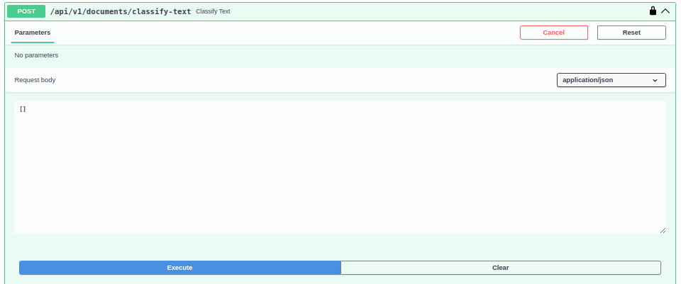

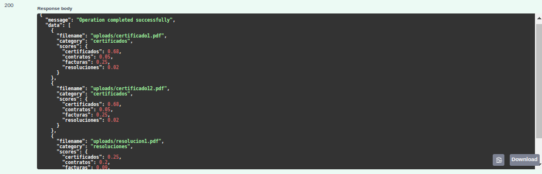

Además se generarán en la base de datos dos nuevos campos, categoria referente a la categoría asignada y los scores, es decir, los puntajes de probabilidad asociados a cada una de las categorías.

#### Detección de datos PII

Este modulo al igual que el anterior, recibe como parámetro una lista opcional de cadenas de texto (tipo list[str]), en la que se especifican los nombres de los archivos en los que se desea realizar la detección de datos PII y de igual manera si la lista se encuentra vacia, va a realizar el proceso en todos los regstros de la base de datos:

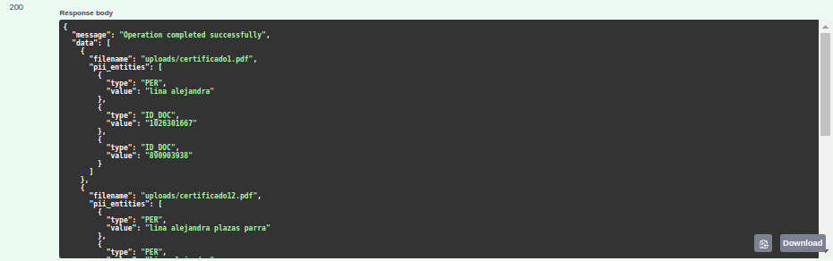

Se generaran en la base de datos el campo llamado pii_entities,el cual tendra una lista de las entidas encontradas con su respectivo valor:

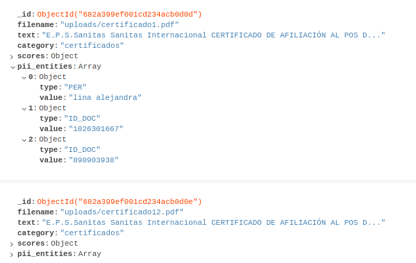

#### Identificación de documentos duplicados o similares

Este módulo realiza una comparación entre todos los documentos PDF almacenados en el bucket S3 con el objetivo de identificar similitudes entre ellos. Además, recibe como parámetro el valor de similarity_threshold, que representa el umbral a partir del cual se considera que dos documentos son similares.

Para efectos de la prueba, se utilizará un valor de 90 como parámetro, lo cual indica que si dos documentos presentan una similitud del 90% o más, serán considerados como documentos similares.

Por otro lado, los documentos serán identificados como duplicados únicamente si alcanzan un 100% de similitud, es decir, si son exactamente iguales en contenido.

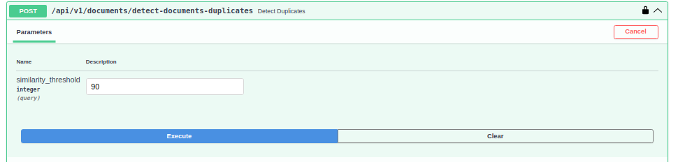

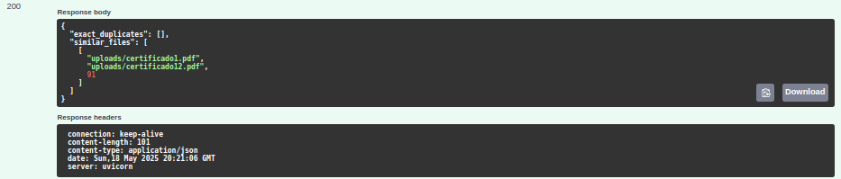

Como se puede observar en la imagen anterior, respecto a los tres archivos almacenados en el bucket S3, no se encontraron documentos duplicados, ya que ninguno alcanzó el 100% de similitud. Sin embargo, los documentos certificado1.pdf y certificado12.pdf presentan un 91% de similitud, por lo que fueron correctamente identificados como documentos similares según el umbral definido en la prueba.

De este modo, también se almacenan los resultados en la base de datos en los campos extract_duplicates y similar_files, las listas de archivos duplicados y similares respectivamente.

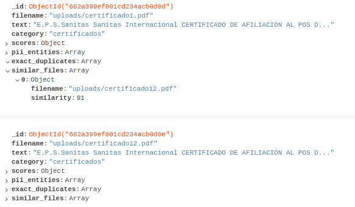

#### Segmentación y extracción de secciones de interés

Al igual que los módulos de clasificación de texto y extracción de entidades, este módulo recibe como parámetro una lista de nombres de archivos desde los cuales se desea extraer las secciones relacionadas con requisitos normativos. En caso de que la lista se envíe vacía ([]), el sistema interpretará que se debe realizar la extracción sobre todos los registros almacenados en la base de datos:

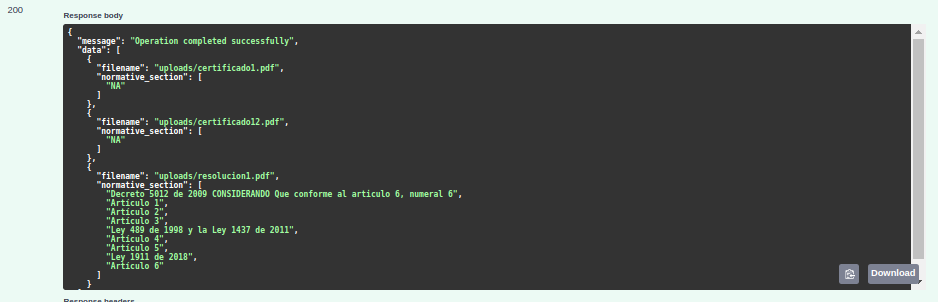

De igual manera, se registra en la base de datos el campo normative_section, en caso de no encontrar nada relacionado con reuisitos normativos coloca el texto NA

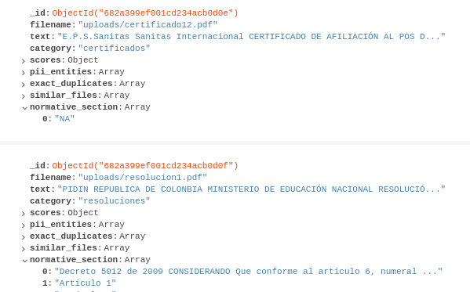
